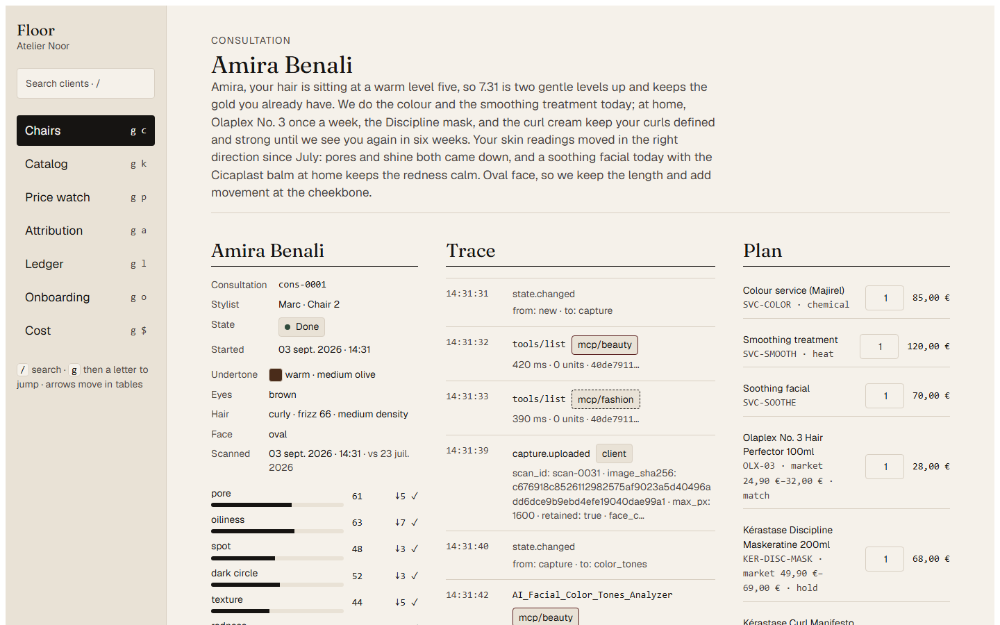
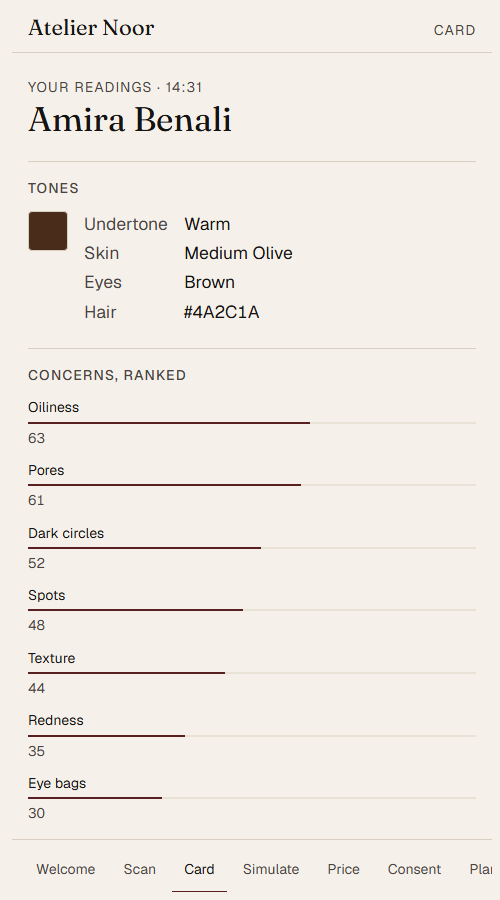
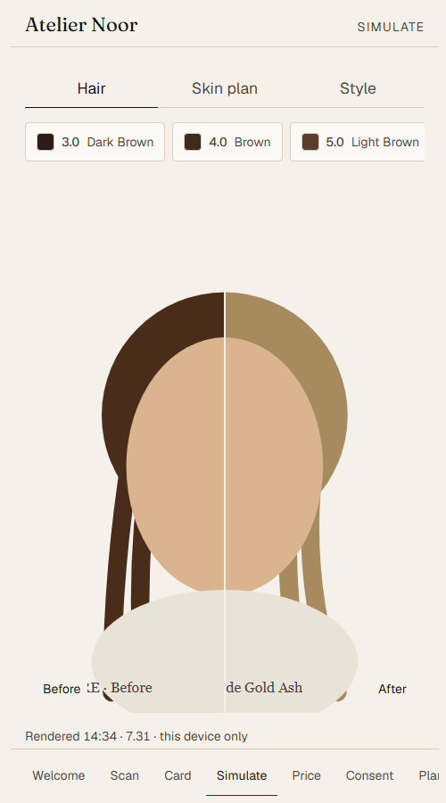
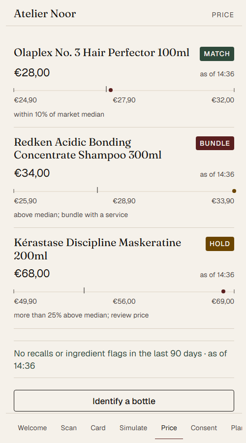
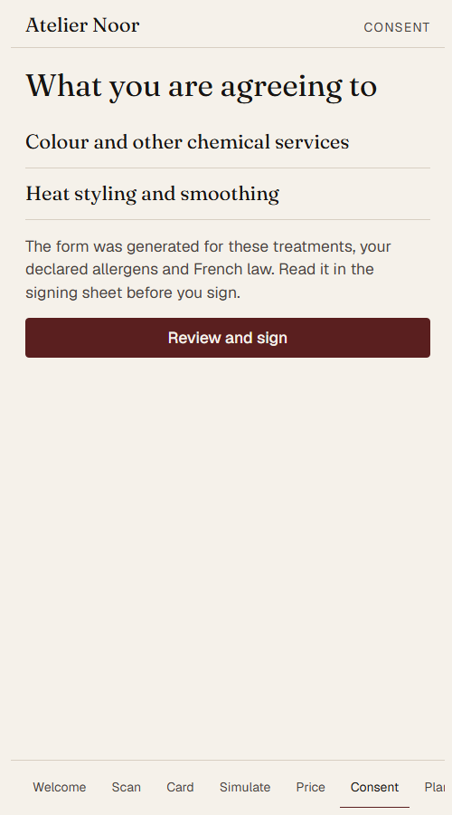

# Chairside

**One prompt opens a salon. One selfie runs the consultation, consents, prices, and remembers.**

Chairside is the AI-native operating system for salons, barbers, and aesthetic clinics. One prompt registers the salon's domain, generates its consent paperwork, parses its paper price list into a catalog, prices every product against today's market, and puts a storefront live. One selfie at the chair runs the consultation: diagnosed, simulated on the client's own face in the salon's own shades, priced against the live market, consented, sold, rebooked, and remembered. It replaces the consultation and retail modules of Mindbody, Vagaro, Fresha, and Zenoti, which treat the consultation as a notes field.



| Mirror · Card | Mirror · Simulate | Mirror · Price | Mirror · Consent |
|---|---|---|---|
|  |  |  |  |

Everything in this repository runs in **fixtures mode** with zero API credits: recorded vendor responses replay end to end. Live mode is one environment flag.

---

## Judges: start here

Each sponsor section answers the same three questions: what the sponsor owns, why the integration is not token (call counts you can check in the trace panel), and where to look in the video. Screenshots referenced below live in `docs/screenshots/`; the sponsor cuts are described shot by shot in [`docs/sponsor-cuts.md`](docs/sponsor-cuts.md) and are linked from the Devpost page once uploaded.

### Perfect Corp (YouCam)
- **Owns:** every diagnosis and every render. Color tones, skin analysis HD, hair type, hair density, hair frizziness, face attributes and ratios, hair color try-on in the salon's own shade, hairstyle by face shape, skin simulation for the plan, aging on request.
- **Why it is not token:** 10 MCP calls per consultation on `mcp/beauty` (6 analyses: color tones, skin HD, hair type, hair density, hair frizziness, face attributes; 3 renders: hair color in the salon's shade, hairstyle by face shape, skin simulation for the plan; 1 tool enumeration) plus the `mcp/fashion` enumeration, 63 YouCam units at list prices. Renders use the shade hex from the salon's editable `shade_map`, so the client sees `7.31 Medium Blonde Gold Ash` as the salon sells it. Trace: `docs/screenshots/floor-consultation-trace.png` (every `mcp/beauty` row with tool name, latency, units, hash). Adapter: `agent/chairside_agent/adapters/youcam.py`.
- **Video:** 1:20–1:55 in the master. Cut: `perfectcorp.mp4`.

### SerpApi
- **Owns:** every number the client sees about the market. Google Lens identifies the bottle in the client's hand; Google Shopping gives min/median/max; Google News checks the last 90 days for recalls and ingredient flags; Google Maps + Maps Reviews summarise what clients say at the two nearest competitors (staff only, never shown to the client).
- **Why it is not token:** 6 searches per consultation (lens 1, shopping 1, news 1, maps 1 to find the two nearest competitors, maps_reviews 2) and 1 shopping search per priced SKU at onboarding (30; the 12 services carry no market price). A Xano nightly task refreshes only snapshots older than 7 days. Every price carries an `as_of`. Screens: `docs/screenshots/mirror-price.png` (salon price on the market bar, verdict, recall line), `docs/screenshots/floor-price-watch.png`. Adapter: `agent/chairside_agent/adapters/serpapi.py`.
- **Video:** 1:55–2:20. Cut: `serpapi.mp4`.

### Xano
- **Owns:** the system of record, auth and RBAC, the signing gate, the background tasks, static hosting for Mirror, Floor, and the storefront, and an MCP server (`chairside-mcp`) other agents can book through, with a Cloudflare Worker OAuth 2.1 proxy for Claude Web and ChatGPT.
- **Why it is not token:** every event the agent writes goes through `POST /agent/events`, which appends a hash-chained `audit_event`. `POST /commit/envelopes/{id}/send` is the only code path in the whole system that can reach Foxit eSign, and it refuses the agent's token. Four scheduled tasks. Source: `xano/workspace/` (96 XanoScript files, validated with the Xano Developer MCP validator); the workspace, task-log, and MCP Builder console captures are listed in `docs/screenshots/README.md` and are added once the workspace is pushed. Screens now: `docs/screenshots/floor-ledger.png`, `docs/screenshots/floor-chairs.png`. The backend is live on instance `xqbd-rqmo-jj2a.m2.xano.io` (workspace `chairside`, pushed with the CLI on 3 Sep 2026); the gate was exercised with real JWTs and returned every contract reason, see [`docs/xano-live-gate.md`](docs/xano-live-gate.md).
- **Video:** 0:35–1:00 (gate + 401) and 2:20–2:40 (booking through `chairside-mcp`). Cut: `xano.mp4`. Build story: below.

### Nutrient DWS
- **Owns:** turning the salon's paper into data. Data Extraction parses the price list, three supplier invoices, and the client's handwritten intake into fields with per-field confidence and bounding-box citations; the Viewer shows low-confidence rows to the owner with the boxes drawn; the confirmed catalog and every consent bundle are sealed with a CAdES B-LT signature.
- **Why it is not token:** 6 operations per onboarding (4 extractions: price list + 3 invoices; 1 build with OCR and PDF/A; 1 seal) and 2 per consultation (1 intake extraction, 1 seal). Fields under 0.85 confidence go to a human (3 price-list rows and the scanned invoice's lines in the demo); nothing is silently accepted. The adversarial intake form is quarantined by a pure function before anything downstream runs. Screens: `docs/screenshots/floor-catalog.png` (review queue with confidence chips), `docs/screenshots/floor-quarantine.png` (the halted consultation and its reason). Adapter: `agent/chairside_agent/adapters/nutrient.py`.
- **Video:** 1:00–1:20. Cut: `nutrient.mp4`. One line: *DWS does the heavy lifting where paper becomes data: extraction with confidence, review with citations, and a seal on what a human confirmed.*

### Foxit
- **Owns:** the reversible document work through Foxit's open-source PDF API MCP server (merge the client packet, compress, OCR the handwritten notes and label crops, convert), and the two signatures that create liability through Foxit eSign with embedded signing sessions.
- **Why it is not token:** 4 MCP tools + 1 envelope per onboarding, 2 tools + 1 envelope per consultation. The agent process holds only PDF Services credentials. `chairside_agent redteam esign` forces the agent to call the eSign API with that credential, receives 401, and writes `redteam.esign_denied` to the ledger. That moment is filmed. Screens: `docs/screenshots/mirror-consent.png` (the embedded signing sheet), `docs/screenshots/floor-ledger.png` (the hash chain; the `redteam.esign_denied` row is the red hairline). Adapters: `adapters/foxit_pdf.py`, `adapters/foxit_esign_proxy.py`.
- **Video:** 0:35–1:00. Cut: `foxit.mp4`. Argument: below.

### Doctavian
- **Owns:** the salon's document family from one template set with real logic: consent forms that branch by treatment class (chemical, heat, injectable, laser), loop over declared allergens, switch clauses by jurisdiction (FR/US), and carry the salon identity; aftercare sheets; the price list; client terms as clickwrap.
- **Why it is not token:** 8 calls per onboarding (the four consent templates and the combined one, aftercare, the price list, the platform agreement, and the client-terms clickwrap) and 1 generation per consultation, each fed real data: the plan's treatment classes from the deterministic core, the allergens extracted from the intake, the salon's jurisdiction. The template family spec is in `seed/README.md`; the editor capture with the branching expressions is added once Doctavian issues credentials (see `docs/screenshots/README.md`). Screens now: `docs/screenshots/mirror-consent.png`. Adapter: `agent/chairside_agent/adapters/doctavian.py`.
- **Video:** 0:35–1:00. Cut: `doctavian.mp4`. One line: *Doctavian did the work of a legal template team: one family, every client right.*

### name.com
- **Owns:** the salon's name on the internet. Search suggestions, availability check, idempotent registration, A and CNAME records pointing at Xano static hosting, URL forwarding for `www`, email forwarding for `hello@`.
- **Why it is not token:** 7 API calls across 6 endpoints per onboarding, chained: the agent cannot deploy the storefront until DNS exists, and the storefront's Book button is what opens Mirror. Screens: `docs/screenshots/floor-onboarding.png` (domain, DNS, forwarding, site as a live log), `docs/screenshots/storefront.png` (the page on the salon domain). Adapter: `agent/chairside_agent/adapters/namecom.py`.
- **Video:** 0:00–0:35. Cut: `namecom.mp4`.

---

## Sponsor-role matrix

| Sponsor | Owns | Calls per onboarding | Calls per consultation |
|---|---|---|---|
| Perfect Corp | Diagnosis + simulation via MCP | 0 | 6 analyses + 3 renders + 2 tool enumerations (63 units) |
| SerpApi | Prices, reviews, recalls | 1 shopping per priced SKU (30) | lens 1 · shopping 1 · news 1 · maps 1 · maps_reviews 2 |
| Xano | System of record, auth, signing gate, tasks, hosting, MCP server | all writes + 2 gate requests | all writes + 2 gate requests + nightly refresh |
| Nutrient | Catalog/invoice/intake extraction, Viewer, seal | 4 extracts + 1 build + 1 sign | 1 extract + 1 sign |
| Foxit | Merge/compress/OCR/convert via MCP; 2 human envelopes | 4 tools + 1 envelope | 2 tools + 1 envelope |
| Doctavian | Consent family, aftercare, price list, platform agreement, clickwrap | 8 calls | 1 generation |
| name.com | search · availability · create · DNS · URL/email forwarding | 7 calls | 0 |

These are the numbers `scripts/cost_report.py` prints from the fixtures-mode ledger after `open` and two completed `consult` runs; its output is in [`docs/cost-report.md`](docs/cost-report.md) and on Floor's Cost page.

---

## Judge mode (two minutes)

Run locally with no keys:

```bash
cd web && npm ci && npm run dev
```

Open `http://localhost:5173/floor/` and `http://localhost:5173/mirror/`. Demo logins (fixtures mode, no server):

| Role | Email | Password |
|---|---|---|
| Owner | noor@example.com | chairside-demo |
| Stylist | lea@example.com | chairside-demo |
| Client | amira@example.com | chairside-demo |

Click path:
1. **Floor → Onboarding**: Act 1 as a live log (domain, DNS, site, templates, agreement, catalog 42 SKUs with 3 to review, prices, shade map, storefront).
2. **Floor → Catalog**: open a low-confidence row in the Viewer; confirm it.
3. **Mirror** (phone width): Welcome → Capture → Card → Simulate (tap `7.31`) → Price (Olaplex No. 3, market bar, recall line) → Consent (sign) → Plan (accept).
4. **Floor → Consultation**: the trace timeline shows every tool call with server, latency, units, and result hash; the plan editor shows the €147 order and the six-week rebooking; staff-only competitor notes are on the right.
5. **Floor → Ledger**: press Verify. The chain recomputes in the browser. The red hairline row is `redteam.esign_denied`; the quarantine row is the adversarial intake.
6. **Mirror → Return**: the six-week overlay with per-concern deltas.

Live (fixtures mode, same build as the repo): [Mirror](https://rushabht3.github.io/chairside/mirror/) · [Floor](https://rushabht3.github.io/chairside/floor/) · [Storefront](https://rushabht3.github.io/chairside/storefront/), deployed by `.github/workflows/pages.yml`. The identical build is uploaded to Xano static hosting (`xano static_host build push` + `deploy`, see `xano/README.md`) at https://chairside-prod-e0cc87-xqbd-rqmo-jj2a.m2.xano.io/mirror/; that host is provisioning on Xano's side at submission time.

---

## Architecture

```
Mirror (client PWA, salon's domain) · Floor (pro console) · Storefront (static, salon's domain)
                    │  JWT from Xano auth · roles: owner / stylist / client
                    ▼
Xano workspace (XanoScript; pushed with @xano/cli)
  tables · APIs (auth, mirror, floor, agent, commit) · RBAC · Commit Service (eSign gate) · tasks
  MCP Builder server `chairside-mcp` (book_appointment, get_consultation_summary, price_check)
  Cloudflare Worker OAuth 2.1 proxy in front of chairside-mcp (Claude Web / ChatGPT)
  static hosting for Mirror, Floor, Storefront
                    ▲
                    │  Xano REST (agent writes events, reads state)
Agent runtime (Python 3.12, google-adk 2.8.0)
  MCP mounts: Foxit PDF API MCP server (stdio) · YouCam /mcp/beauty · YouCam /mcp/fashion
  REST adapters: SerpApi · name.com Core v1 · Doctavian · Nutrient DWS · Xano
  Agents: Onboarding (Act 1) · Consultation (Act 2)
  Deterministic core · quarantine policy · event writer · fixtures cassettes
```

**The credential rule.** The agent process env holds the Perfect Corp key, the SerpApi key, name.com sandbox credentials, Doctavian credentials, the Nutrient key, and Foxit **PDF Services** credentials. The Xano workspace env holds Foxit **eSign** credentials. Nothing else ever holds eSign credentials, and `POST /commit/envelopes/{id}/send` checks the caller's role and the envelope's state before it uses them. CI fails if a key pattern is committed.

---

## Deterministic core

The LLM narrates; code decides. Anything that affects money, consent, or data is a pure function with unit tests in `agent/chairside_agent/core/`:

| Function | Decides | Tests |
|---|---|---|
| `recommend_plan` | concern thresholds → treatment classes → services and products from the salon's catalog; rebook interval | `test_core_recommend_plan.py` |
| `price_policy` | match / bundle / hold against the market snapshot, integer arithmetic, stale-snapshot flag | `test_core_price_policy.py` |
| `consent_template_select` | which Doctavian template, with treatment classes, allergens, jurisdiction, salon and client identity | `test_core_consent.py` |
| `sku_shade_map` | shade code → hex/undertone/level from the salon-edited table; unknown code raises | `test_core_shade_map.py` |
| `quarantine_policy` | instruction-like text, VAT and line-total arithmetic (Decimal, ROUND_HALF_UP), duplicate invoice numbers, multi-face scans, missing consent | `test_core_quarantine.py` |

Every step of both agents writes a `consultation_event`; Floor, the ledger, and `chairside_agent replay <id>` are projections of that stream. The agent suite is 135 tests: the five core functions, the parse-prompt grammar, one contract test file per vendor over its cassettes, both state machines end to end in fixtures mode (including a monkeypatched failure that must halt at `needs_attention`), replay, and the red-team command. The web suite is 35 tests: the hash chain against the shared vectors, the snapshot's 202-row chain, price-bar math, contrast, asset-URL resolution under a sub-path deploy, the one-face heuristic, and the storefront size cap. Every adapter has a live path and a fixtures path; `scripts/record_fixtures.py` makes one real call per primitive with `RECORD=1` and writes the cassette that fixtures mode replays. Contract tests per vendor run against the cassettes. The YouCam cassettes (colour tones, skin HD, face attributes, hair colour, hairstyle, skin simulation, aging, both tool lists) were recorded against the live YouCam API on 3 Sep 2026 from a public portrait, and the before/after images under `web/public/renders/amira-*` are those real outputs. Hair type, density, and frizziness need front, right, and left views, so those three cassettes are still hand-written. All five SerpApi cassettes (Lens, Shopping, News, Maps nearby, Maps reviews) are live responses from the same day, so the market snapshot, the competitor list, and the review summaries in the demo are real Paris data. Nutrient extracted the salon's price list (42 rows, 168 fields with a page and a box each) and all three supplier invoices live, including the scanned one and the one whose line 2 is 12.00 out; the three handwritten intake scans keep their hand-written cassettes, because live extraction misreads the synthetic handwriting and does not see the near-white injected instruction line that the quarantine test needs. `/build` and `/sign` answer 403 on a Data Extraction key, so those two cassettes are hand-written as well. Foxit PDF Services answered live too, through the sponsor's own MCP server: the tool list, merge, compress, OCR of the scanned invoice, and HTML to PDF. Clone that server into `vendor/` first:

```bash
git clone https://github.com/foxitsoftware/foxit-pdf-api-mcp-server.git vendor/foxit-pdf-api-mcp-server
```

Version 0.2.3 ships a console script pointing at a module the wheel does not contain, so `adapters/foxit_pdf.py` starts the server by its real module path instead.

So YouCam, SerpApi, Nutrient extraction, and Foxit PDF Services all replay real responses recorded on 3 Sep 2026. name.com answered the two read-only calls live, so the suggestions and the availability verdicts are what the registry really says today: `ateliernoor.com` and `ateliernoor.fr` are taken, `ateliernoor.paris` is free at 65.99. Registration, DNS, and the two forwarding calls keep their hand-written cassettes, because running them against a live account buys a real domain, and the sandbox that exists for exactly this purpose answers 401 on an unprovisioned account. Doctavian and Foxit eSign stay on hand-written cassettes too: Doctavian issues credentials by email, and the eSign credential is deliberately held by Xano alone, where the agent cannot reach it.

```bash
cd agent && uv sync --group dev
uv run pytest -q
uv run chairside_agent reset
uv run chairside_agent open "Open Chairside for Atelier Noor, 14 Rue de Turenne, 75003 Paris. Hair, skin, brows. Three chairs. Owner: Noor Haddad, noor@example.com."
uv run chairside_agent consult cl-01 --chair 2 --stylist Léa
uv run chairside_agent redteam esign
uv run chairside_agent replay cons-0001
uv run python ../scripts/cost_report.py
```

---

## Privacy and security

- **Selfies** are resized to ≤1600 px on the device in a Web Worker, uploaded by signed URL, and deleted after render unless the client toggles progress tracking (default off). "Delete everything now" tombstones the client's events.
- **One client per scan.** Face count is checked on the device before upload; the vendor's multi-face error is the second guard; `quarantine_policy` is the third.
- **RBAC.** Owner sees everything; a stylist sees their own chairs and attribution; a client sees only their own record. Competitor reviews are staff-only at the API layer, not hidden in the UI.
- **Sealed consents.** Consent + intake + scan bundle is sealed with a CAdES B-LT signature and archived with a hash-chained audit event.
- **Hash chain.** `audit_event(prev_hash, hash)` over canonical JSON (sorted keys, no whitespace, integers only) with SHA-256. Python and TypeScript implementations are tested against the same vectors in `docs/hash-vectors.json`; Floor's Verify recomputes the chain in the browser.
- **Contrast.** Every text/background pair is ≥ 7:1; `web/src/lib/contrast.test.ts` checks the token pairs (ink/paper 16.3, ink/bone 14.3, paper/accent 11.3, ink-2/paper 8.5).
- **Lighthouse (Mirror, mobile).** Performance 98, accessibility 100, best practices 100, SEO 100; see [`docs/lighthouse-mirror.md`](docs/lighthouse-mirror.md).
- **Secrets.** `.env.example` only; CI and `scripts/secret_scan.sh` fail on key patterns.

---

## Xano build story

- **What we replaced:** the consultation and retail modules of Mindbody, Vagaro, Fresha, and Zenoti.
- **Why:** a consultation decides whether a client returns, and the incumbents store it as a notes field.
- **AI tools:** Claude Code with the Xano CLI and the Xano Developer MCP for XanoScript; Google ADK for the two agents; Foxit's and Perfect Corp's MCP servers as tool mounts.
- **How long:** one working day, 3 September 2026, from an empty directory to a fixtures-mode build with both acts, the console, the PWA, and the tests.
- **What would have taken longer without AI + Xano:** auth and RBAC, four background jobs, the signing gate as a server-side policy rather than a prompt, static hosting on custom domains, and an MCP server other agents can call, each of which is a day of plumbing in a hand-rolled backend.

## The Foxit boundary

Under eIDAS, a seal asserts integrity on behalf of a legal person; a signature asserts a natural person's consent. The agent may prepare documents and may seal their integrity. Only a person consents, and consent creates liability, so the boundary is not a prompt the model might skip: it is a credential the agent process does not have. The reversible tools sit in the agent's hands; the two signatures live behind a gate that checks state and role. `chairside_agent redteam esign` proves the boundary every time it runs.

## Deviations from the brief found in vendor docs

- **YouCam servers.** Perfect Corp's MCP docs put every hair tool on the Beauty server; the Fashion server is apparel. The trace therefore shows `mcp/beauty` for hair renders, and `mcp/fashion` appears once, at tool enumeration.
- **Hair diagnostics** are three vendor tools (type, density, frizziness), so one diagnostic step is three trace rows.
- **Nutrient `/sign`** does not accept `signatureType`/`cadesLevel`; DWS forces SHA-256 and CAdES B-LT. The adapter sends only `flatten: false` and records the level as a constant.
- **Doctavian** credentials and docs arrive by email. The adapter's endpoint paths are documented in its module docstring as the single place to adjust.
- **Unverified units** (no keys yet): YouCam unit costs for skin HD, hair type/density, bangs and volume are the documented list prices and are labelled as such in the cassettes.

---

## Market

- Zenoti raised $160M at a valuation above $1B ([GeekWire, Dec 2020](https://www.geekwire.com/2020/zenoti-hits-1b-valuation-raises-160m-build-enterprise-software-salons-spas-yoga-studios/)).
- Vista Equity Partners took Mindbody private for $1.9B ([Business Insider, Dec 2018](https://www.businessinsider.com/mindbody-going-private-19-billion-deal-2018-12)).
- Fresha reached a valuation above $1B on an $80M investment from KKR ([TechCrunch, May 2026](https://techcrunch.com/2026/05/21/booking-platform-fresha-announces-80m-investment-unicorn-valuation/)).

---

## Setup

1. Copy `.env.example` to `.env`; leave `CHAIRSIDE_MODE=fixtures` for zero-credit runs, or set `live` and the keys.
2. Agent: `cd agent && uv sync --group dev && uv run pytest -q`.
3. Web: `cd web && npm ci && npm run build && npm run build:storefront`.
4. Xano: follow [`xano/README.md`](xano/README.md) (`xano workspace push`, env vars, static host deploy).
5. OAuth proxy for Claude Web / ChatGPT: [`worker-oauth/README.md`](worker-oauth/README.md).
6. Open a salon: `uv run chairside_agent open "<prompt>"`.

Pinned versions: `google-adk==2.8.0`, `mcp==2.1.1`, `httpx==0.28.1`, `pydantic==2.13.5`; `@xano/cli@1.2.0`, `@nutrient-sdk/viewer@1.21.0`, `@modelcontextprotocol/sdk@1.30.0`, React 19, TypeScript 5, Vite.

License: MIT.
